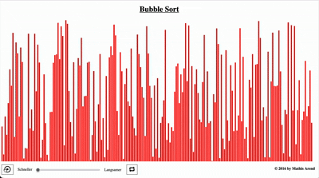

# Sort
A visualisation of the bubble sort algorithm I made in high school using simple web technology. 

Just open the Sort.html file and Bubble Sort will be visualised using bars. On the bottom you have the option to go faster, slower, reinitialize or pause. 

## Demo

